# Sonic WAN buildout — staged plan

## Context

Sonic is delivered to the rb5009 on `sfp-sfpplus1` (link up). Monkeybrains
stays live on `ether2`. Today `sfp-sfpplus1` is unconfigured
(`config.rsc:9` calls it out), so every flow still egresses MB.

End state, already designed in
[`IPV6-PLAN.md` § Phase C](IPV6-PLAN.md):
per-SSID WAN selection (plumtree → Sonic primary, guest/iot/mgmt → MB
primary), v6 dual-GUA per VLAN biased by RA `preferred-lifetime`, and
Netwatch-driven failover both directions. The model is sound and the
schema probes (1, 2, 3) on 2026-05-07 already de-risked it.

The work is too large for one apply. This plan stages it into **four
applies**, each via the wipe-and-replay flow in [`README.md`](README.md)
and each independently testable and revert-safe.

```mermaid
flowchart TD
    S0["Stage 0 (pre-apply): live-router schema probes<br/>verify ipv6 dhcp-client default-route-distance,<br/>routing-mark+connection-mark interaction with fasttrack,<br/>check-gateway behavior. Capture Sonic PD length + gateway facts."]
    S1["Stage 1: Sonic as PASSIVE secondary<br/>+ ipv6 dhcp-client sonic-pd, +ip dhcp-client sfp-sfpplus1<br/>+sfp-sfpplus1 to WAN list<br/>NO per-VLAN PBR, NO sonic-pd /64s on VLANs"]
    S2["Stage 2: v4 per-SSID PBR<br/>+routing tables mb, sonic<br/>+manual 0.0.0.0/0 routes per table (distance 1 & 2)<br/>+manual ::/0 routes per table<br/>+mangle (connection-mark, routing-mark)<br/>+fasttrack predicate connection-mark=no-mark<br/>Both DHCP clients switch to add-default-route=no"]
    S3["Stage 3: v6 dual-GUA + source-PBR<br/>+ipv6 address from-pool=sonic-pd per VLAN<br/>+ipv6 nd prefix preferred-lifetime overrides<br/>+ipv6 firewall mangle (src-address PBR)"]
    S4["Stage 4: Netwatch + RA-timer flip<br/>+netwatch mb-probe, sonic-probe (per-table)<br/>+scripts mb-up/down, sonic-up/down<br/>+scheduler reconcile from route state<br/>tighten min-rtr-adv-interval"]
    Verify1["Verify: MB still primary on all SSIDs.<br/>Pull MB: Sonic active. v6 degraded (no sonic-pd GUAs yet) — expected."]
    Verify2["Verify: plumtree v4 egresses Sonic; others MB.<br/>Pull either WAN: per-SSID fall-through within check-gateway window."]
    Verify3["Verify: clients carry ULA + mb-pd + sonic-pd.<br/>Default-preferred GUA matches v4 routing per VLAN.<br/>Pull primary WAN: v6 broken on that VLAN until next RA — Stage 4 closes."]
    Verify4["Verify: v6 failover matches v4 within one RA interval.<br/>Reconciler re-asserts state after manual mis-set."]
    S0 --> S1 --> Verify1 --> S2 --> Verify2 --> S3 --> Verify3 --> S4 --> Verify4
```



The gates between stages aren't decoration — Stage 3 needs Stage 1's
actual PD length and prefix to write source-PBR rules; Stage 4 needs
Stages 2 + 3 settled to flip timers meaningfully.

## Final design (reference)

Already documented at [`IPV6-PLAN.md` § Phase C](IPV6-PLAN.md). Key
points reused below — don't restate the model, only deltas.

- Two routing tables (`mb`, `sonic`); each carries both `::/0` and
  `0.0.0.0/0` with local WAN d=1, other WAN d=2.
- v4 PBR: per-VLAN `in-interface` → `mark-connection` → `mark-routing`.
- v6 dual-GUA: every VLAN gets a `/64` from each pool; RFC 6724 source
  selection biased by per-prefix `preferred-lifetime` overrides.
- v6 PBR: `mark-connection` on `src-address` matching pool prefixes
  (load-bearing — without it, MB BCP38-drops sonic-pd-sourced packets).
- Netwatch + scripts flip RA timers on WAN-down → next-RA migration.
  v4 failover is router-side route-distance, immediate.

## Stage 0 — pre-apply schema probes (live router, no `config.rsc` edits)

The probes from 2026-05-07 covered Phase B / C v6 schema but NOT these
Sonic-day specifics. Run these on the live router (probe-then-revert,
`comment="probe-only-remove-after"`, same hygiene as IPV6-PLAN.md §
Schema verification probe). They produce facts the later stages encode.

| Probe | Question | How |
|-------|----------|-----|
| **A** | Does `/ipv6 dhcp-client` accept `default-route-distance=N`? | Try `set [find pool-name=mb-pd] default-route-distance=1`. If accepted, Stage 1's manual `::/0` route disappears — use the property instead. If rejected, the draft's manual-route plan stands. |
| **B** | Does `routing-mark` set in mangle prerouting correctly steer marked conns when fasttrack is active? | Add a no-op `mark-routing` rule on a test VLAN, watch counters. Confirms whether the `connection-mark=no-mark` fasttrack predicate is actually needed (it is, but verify on 7.21.4). |
| **C** | What does `check-gateway=ping` do against a DHCP-bound `0.0.0.0/0` route on `ether2` today? | Temporarily add `check-gateway=ping` to MB's existing default route via `/ip route`. Watch behavior when MB upstream is pinged; restore. Validates the Stage-2 monitoring assumption. |
| **D** | What does Sonic actually deliver? PPPoE vs DHCP? IA_NA + IA_PD or PD-only? PD length? | Add `/ip dhcp-client` and `/ipv6 dhcp-client` (pool-name=`sonic-pd-probe`) on `sfp-sfpplus1`, observe. Record the v4 gateway literal IP, v6 upstream link-local, and PD length. Remove before exporting. |

**Outputs captured for downstream stages:**

- Sonic delivery model (DHCP/IPoE vs PPPoE — if PPPoE, Stage 1's `ip
  dhcp-client` becomes `/interface pppoe-client` and the v4 plan shifts).
- Sonic PD length (drives Stage 3's per-VLAN /64 sizing; `/64` or no PD
  trigger the edge-case rows in IPV6-PLAN.md's table).
- Sonic v4 next-hop literal IP (Stage 2 `check-gateway`).
- Sonic v6 upstream link-local `fe80::…%sfp-sfpplus1` (Stage 1 manual
  ::/0 route if probe A says manual route is needed; Stage 2 manual ::/0
  routes per table unconditionally).
- Sonic-delivered v4 + v6 resolvers (recorded; no `config.rsc` impact —
  `use-peer-dns=yes` defaults already cover it).

## Stage 1 — Sonic as passive secondary WAN

**Goal:** Sonic binds v4 + v6, joins WAN interface-list, but does not
attract traffic in steady state. Everything still egresses MB.

### `config.rsc` changes

- Topology comment at top (line 9): `sfp-sfpplus1  WAN (sonic, DHCP
  client)`.
- `/ip dhcp-client` (after current `add interface=ether2` at line 239):
  `add interface=sfp-sfpplus1 default-route-distance=2 use-peer-dns=yes`.
  MB stays default (distance 1).
- `/ipv6 dhcp-client` (after current MB entry at line 251):
  `add interface=sfp-sfpplus1 request=address,prefix pool-name=sonic-pd
  pool-prefix-length=64 accept-prefix-without-address=yes` plus EITHER
  - `default-route-distance=2` if Stage 0 probe A says the property
    exists (preferred), OR
  - `add-default-route=no` + a manual route entry below.
- If manual route needed: `/ipv6 route add dst-address=::/0
  gateway=<sonic-LL>%sfp-sfpplus1 distance=2` using the LL captured in
  Stage 0 probe D. Document it inline; flag for renewal-stability review
  (Sonic's LL is stable per RFC unless they swap hardware).
- `/interface list member`: `add interface=sfp-sfpplus1 list=WAN` after
  the existing ether2 entry at line 123. This brings Sonic under the
  existing input drop, forward "WAN-originated non-DSTNATed" drop, and
  masquerade — all use `in-interface-list=WAN` / `out-interface-list=WAN`
  already, so no other edits needed.
- **No** `/ipv6 address from-pool=sonic-pd` on VLANs. Stage 1 must be
  observably "MB everywhere" until Stage 3.

### Verify

- `/ip dhcp-client print` — Sonic bound, IPv4 + gateway captured.
- `/ipv6 dhcp-client print detail` — Sonic bound, prefix shown, length
  matches Stage 0 probe D. `sonic-pd` pool populated.
- `/ip route print where dst-address=0.0.0.0/0` — two routes; MB d=1
  active, Sonic d=2 inactive.
- `/ipv6 route print where dst-address=::/0` — same shape.
- From plumtree: `curl -4 ipinfo.io` and `curl -6 ipinfo.io` both show
  MB (`AS32261`, `2607:f598:d488::/47`).
- Failover smoke test: unplug MB ether2. Within ~10s, Sonic v4 route
  activates and `curl -4 ipinfo.io` returns Sonic ASN. v6 traffic
  partially breaks because clients still hold only `mb-pd` GUAs — this
  is the gap Stage 3 closes; record it in the apply notes. Re-plug,
  traffic reverts.

## Stage 2 — v4 per-SSID PBR

**Goal:** plumtree v4 egresses Sonic; guest/iot/mgmt v4 egress MB.
Symmetric failover via `check-gateway` + route distance.

This stage is **not purely additive**: both DHCP clients (v4 + v6, both
WANs) switch to `add-default-route=no`, and *all* defaults get installed
manually. The wipe-and-replay flow keeps the live transition clean; the
diff vs Stage 1 will yank routes Stage 1 relied on.

### `config.rsc` changes

- `/routing table`: `add name=mb fib=yes`, `add name=sonic fib=yes`.
- Both v4 DHCP clients: `add-default-route=no`. They still bind
  addresses and the gateway is still readable from `/ip dhcp-client`,
  we just install the routes by hand.
- Both v6 DHCP clients: `add-default-route=no` (or its equivalent, see
  Stage 1). Same reason.
- `/ip route` — six `0.0.0.0/0` entries (3 tables × 2 WANs):

  | Table  | Gateway          | Distance | `check-gateway` |
  |--------|------------------|----------|-----------------|
  | `main` | MB next-hop IP   | 1        | `ping`          |
  | `main` | Sonic next-hop IP| 2        | —               |
  | `mb`   | MB next-hop IP   | 1        | `ping`          |
  | `mb`   | Sonic next-hop IP| 2        | —               |
  | `sonic`| Sonic next-hop IP| 1        | `ping`          |
  | `sonic`| MB next-hop IP   | 2        | —               |

  Gateway is the literal next-hop IP captured in Stage 0/1, not the
  interface — `check-gateway` against a DHCP-bound interface pings the
  resolved DHCP server, which the ISP may not answer; pinging the
  literal next-hop is more reliable. Fall back to
  `check-gateway=arp` only if the upstream silently drops ICMP and Stage
  0 probe C documented that.

- `/ipv6 route` — same 6-row shape with `dst-address=::/0`, gateways as
  the upstream link-locals (`fe80::…%ether2`, `fe80::…%sfp-sfpplus1`).
  RouterOS v6 routes accept `check-gateway` on 7.x; use `ping` mirroring
  v4. Verify in Stage 0 probe C.

- `/ip firewall mangle` (prerouting, two-pass — pattern keeps return
  traffic on a marked conn correctly routed):

  ```
  # pass 1 — mark connection on first packet of new flows from a VLAN
  add chain=prerouting in-interface=vlan10 connection-state=new \
      action=mark-connection new-connection-mark=plumtree-conn passthrough=yes
  add chain=prerouting in-interface=vlan20 connection-state=new \
      action=mark-connection new-connection-mark=mb-conn       passthrough=yes
  add chain=prerouting in-interface=vlan30 connection-state=new \
      action=mark-connection new-connection-mark=mb-conn       passthrough=yes
  add chain=prerouting in-interface=vlan88 connection-state=new \
      action=mark-connection new-connection-mark=mb-conn       passthrough=yes
  # pass 2 — route-mark from connection-mark; no in-interface so this fires
  # on return-WAN traffic too. passthrough=no avoids further mangle work.
  add chain=prerouting connection-mark=plumtree-conn \
      action=mark-routing new-routing-mark=sonic passthrough=no
  add chain=prerouting connection-mark=mb-conn \
      action=mark-routing new-routing-mark=mb    passthrough=no
  ```

- **Fasttrack exclusion.** Marked conns must skip fasttrack
  (fasttrack's per-packet shortcut can desync routing-mark state on
  marked flows). Replace the existing fasttrack rule at
  `config.rsc:288`:

  - Before: `action=fasttrack-connection chain=forward
    connection-state=established,related`
  - After: same + `connection-mark=no-mark`.

  Same predicate added to the v6 fasttrack rule at line 327.

- `/ip firewall nat`: existing masquerade
  (`out-interface-list=WAN`) at line 301 needs no change; it NATs out
  whichever WAN a packet actually exits.

### Verify

- `curl -4 ipinfo.io` from plumtree → Sonic ASN; from
  guest/iot/mgmt host → MB ASN.
- `traceroute -4` from each SSID confirms first ISP hop.
- Pull Sonic SFP: plumtree falls through to MB within `check-gateway`'s
  detection window. Restore: reverts to Sonic.
- Pull MB ether2: guest/iot/mgmt fall through to Sonic. Restore: reverts.
- `/ip firewall mangle print stats` — counters show pass-1 and pass-2
  rules matching the expected per-VLAN traffic.

## Stage 3 — v6 dual-GUA per VLAN

**Goal:** v6 follows v4 per-SSID routing in steady state. Source-PBR
ensures clients sending from the "wrong" GUA still egress via the matching
WAN.

### `config.rsc` changes

- `/ipv6 address`: parallel to the existing `from-pool=mb-pd` entries
  (lines 261–264), add `from-pool=sonic-pd advertise=yes` for vlan88,
  vlan10, vlan20, vlan30. Both pools advertise simultaneously; clients
  SLAAC one GUA per pool per VLAN.

- `/ipv6 nd prefix`: per-prefix `preferred-lifetime` overrides
  (probe 2 of 2026-05-07 already confirmed the schema):

  | VLAN   | `mb-pd` preferred-lifetime | `sonic-pd` preferred-lifetime |
  |--------|----------------------------|-------------------------------|
  | vlan10 | `0s` (deprecated)          | default (preferred)           |
  | vlan20 | default (preferred)        | `0s` (deprecated)             |
  | vlan30 | default (preferred)        | `0s` (deprecated)             |
  | vlan88 | default (preferred)        | `0s` (deprecated)             |

  `valid-lifetime` stays default on all — non-preferred prefixes are
  still routable for inbound, just not picked by RFC 6724 for outbound.

- `/ipv6 firewall mangle`: prerouting source-prefix marks, two-pass
  pattern mirroring v4. Pass 1 marks the connection by `src-address`
  matching the literal pool prefix observed in Stage 1 (`mb-pd` `/56`
  today, `sonic-pd` length per Stage 0/1); pass 2 mark-routings from
  the connection-mark. **Mandatory, not a safety net** — Stage 2's v4
  in-interface PBR rules don't fire on v6 (separate filter tables), so
  without v6 source-PBR a vlan10 client sending from its `mb-pd` GUA
  egresses via Sonic and gets BCP38-dropped.

  **Doc sync:** `IPV6-PLAN.md` § Phase C v6 layer currently calls
  source-PBR a "safety net" (line 332 of that file). Update wording to
  "mandatory" during this apply so the design doc matches reality.

- v6 fasttrack exclusion is already covered by the Stage 2 edit to the
  v6 fasttrack rule at line 327.

### Revert tarpit

Reverting Stage 3 without prep strands clients with `sonic-pd` GUAs at
default `valid-lifetime` (≈4w2d). With Stage 2's in-interface PBR and
no v6 source-PBR, packets sourced from those stale GUAs route via
vlan-PBR and BCP38-drop. RFC 6724 fallback recovers in seconds for new
flows but in-flight TCP tarpits.

**Revert procedure:** on the live router, set both pools'
`preferred-lifetime` AND `valid-lifetime` to `0s` on every VLAN; wait
one RA interval (≈2–10 min, faster if Stage 4 already tightened it) so
clients drop the addresses; THEN apply the Stage-2 `config.rsc`.

### Verify

- `ip -6 addr` on a plumtree client: three v6 addresses (ULA, `mb-pd`
  GUA deprecated, `sonic-pd` GUA preferred).
- `curl -6 ipinfo.io` from plumtree → Sonic ASN (sourced from
  `sonic-pd`). From guest/iot/mgmt → MB ASN (sourced from `mb-pd`).
- Mangle counters in `/ipv6 firewall mangle print stats` increase.
- Pull Sonic SFP: plumtree v6 breaks until next RA — Stage 4 closes
  this. v4 still falls through cleanly per Stage 2.

## Stage 4 — Netwatch + dynamic v6 preferred-lifetime flip

**Goal:** v6 failover symmetric with v4 — primary WAN down flips the
deprecated/preferred designation so clients migrate on the next RA.

### `config.rsc` changes

- `/tool netwatch`: two probes pinging the same external target through
  different tables.

  ```
  add comment=mb-probe    type=icmp host=1.1.1.1 routing-table=mb    \
      interval=10s timeout=2s up-script=mb-up    down-script=mb-down
  add comment=sonic-probe type=icmp host=1.1.1.1 routing-table=sonic \
      interval=10s timeout=2s up-script=sonic-up down-script=sonic-down
  ```

  Same target through both probes avoids target-side outages firing
  false WAN-down events.

- `/system script`: four scripts (`mb-up`, `mb-down`, `sonic-up`,
  `sonic-down`). Each sets `preferred-lifetime` on the affected
  `/ipv6 nd prefix` entries:

  - `sonic-down`: vlan10 flips — `sonic-pd` prefix → `0s`, `mb-pd`
    prefix → default. vlan20/30/88 untouched (their primary is MB,
    still up).
  - `sonic-up`: vlan10 reverts to Stage-3 defaults.
  - `mb-down` / `mb-up`: symmetric for vlan20/30/88.

  Use `find` by prefix string (or by interface + pool reference,
  whichever is stable in 7.21.4 — verify the find selector at apply
  time; the prefix string changes on PD renewal, so find-by-interface
  + matching-pool-prefix is more robust).

- `/system scheduler`: a periodic reconciler (5–10 min interval) that
  reads route state (`/ip route get [find …] active` per table), not
  Netwatch status, and re-asserts the preferred-lifetime values.
  Route state is what actually matters for traffic; reading it
  side-steps Netwatch transient flap states. Belt-and-suspenders
  against a missed event.

- Tighten `/ipv6 nd` `min-rtr-adv-interval` on vlan10/20/30/88 to
  15–30s so RA-driven failover converges faster. Don't go too low or
  RA traffic becomes background noise.

### Verify

- Trigger `sonic-down` manually first (before pulling cable) — confirm
  `/ipv6 nd prefix print` shows the timer flip.
- Pull Sonic SFP: within `check-gateway` window v4 plumtree falls to
  MB; within one RA interval plumtree v6 clients see `sonic-pd`
  deprecated, `mb-pd` preferred; new `curl -6` sources from `mb-pd`,
  egresses via MB.
- Restore. Within Netwatch's recovery interval, scripts revert.
- Reconciler: manually misset `preferred-lifetime` on one entry; wait
  the scheduler tick; confirm restoration.
- Symmetric story for MB pull.

## Critical files

- [`config.rsc`](config.rsc) — every stage edits this and re-applies
  via wipe-and-replay.
- [`IPV6-PLAN.md`](IPV6-PLAN.md) § Phase C — parent design doc; tick the
  Phase C checklist as each stage lands; update the "safety net" wording
  in Stage 3.
- [`../CLAUDE.md`](../CLAUDE.md) "What's next" — Sonic WAN buildout
  bullet collapses as stages land.
- [`snapshots/`](snapshots/) — pre-apply backups land here per the
  existing apply flow ([`README.md`](README.md) step 1).

## Reuse vs new code

- The existing `/interface list member` membership-driven WAN rules
  (input drop, forward drop, masquerade — at lines 283, 291, 301)
  already correctly handle multiple WANs. No new firewall infrastructure
  needed beyond mangle and the fasttrack predicate tweak.
- The wipe-and-replay flow in [`README.md`](README.md) (Apply
  section) is used unchanged for each stage's apply — including the
  `:parse` pre-flight, the post-reset SSH-host-key handling, and the
  IPv6 link-local recovery backdoor if a stage breaks v4.
- `from-pool=` semantics on `/ipv6 address` are already understood
  (probe 1, 2026-05-07): no `address=` argument, prefix-only-to-interface.
  Stage 3 uses the same form for `sonic-pd`.

## Sequencing notes

- Each stage is its own `scp config.rsc … && /system reset-configuration
  … run-after-reset=config.rsc` cycle. Brief outage (~60–90s) per apply.
- Verify Stage N for "at least a few hours / a day" in production before
  starting Stage N+1, so transient breakage on one stage doesn't
  compound into the next.
- Stage 1 is the riskiest in terms of "what does Sonic actually look
  like at the wire" — Stage 0 probes are non-negotiable.
- Stages 2 and 3 each leave a "primary-WAN-down → v6 partially
  degraded" gap until Stage 4 closes it. IPV6-PLAN.md's `C-v4` then
  `C-v6` split is exactly this trade-off; Stages 2+3 here are that same
  intermediate state.
- Keep `/ip ssh password-authentication=yes` (per the CLAUDE.md
  deferred-tightening note) until all four stages have settled. The
  password fallback stays the belt-and-suspenders while this work is
  active. Revisit when the buildout is done.
